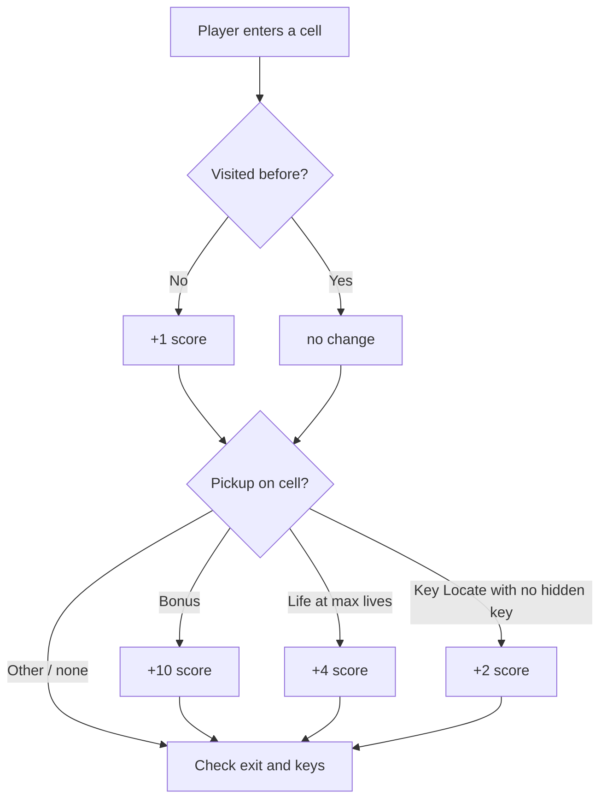
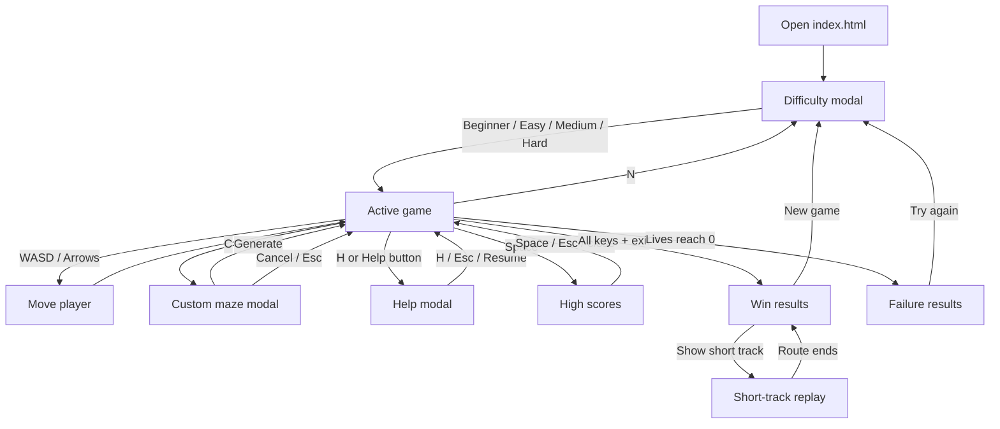
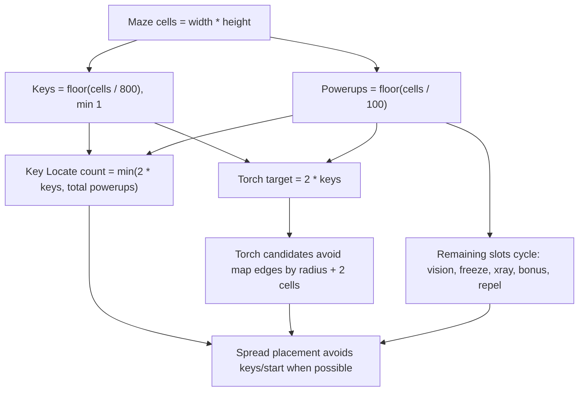

# LABY — Maze Game

Pure static web game (no backend, no build step). Open `index.html` in a browser.

## Files

| File | Purpose |
|---|---|
| `index.html` | Single page: header with stats, game viewport, overlays, modals |
| `game.js` | All logic in one IIFE: maze gen, game state, camera, rendering, input |
| `style.css` | Full styling, ZX Spectrum palette, pixel font, animations |
| `assets/sprites/*.svg` | Editable SVG sprites used directly by the game |

## Run

Open `index.html` directly, or serve the folder with any static HTTP server:

```bash
python3 -m http.server 8765
```

Then open `http://127.0.0.1:8765/`.

## Architecture

### Maze generation (`generateMaze`)

- Recursive backtracking on odd-sized grid
- Grid stored as flat `Uint8Array(w * h)` with numeric constants (`WALL=0`, `PATH=1`, `EXIT=2`), accessed via `grid[y * w + x]`
- Extra paths opened (`grid cells / 32` walls removed) for more loops and multiple solutions
- Start: left side, randomly top `(1,1)` or bottom `(1,h-2)`
- Exit: right side on the opposite diagonal: `(w-2,h-2)` or `(w-2,1)`
- Generation uses a short seed code accepted in settings and shown on win/death results
- Default: 71x41, configurable up to 151x151

### Camera system (`updateCamera`, `applyPositions`)

- Single large maze with side-scrolling camera follow
- Camera tracks player at ~40% from left, ~50% from top
- `camX`/`camY` snapped to integer cell positions
- CSS `transition: transform 0.12s` on `.maze-container` gives smooth cell-by-cell scroll
- Small mazes (fit in viewport) are centered automatically
- Player and enemies are children of `.maze-container` — their transforms are relative to the maze origin
- Both container and player have matching transition timing so camera-follow looks correct

### Rendering (`buildGrid`, `renderMaze`)

- `buildGrid()`: creates all cell `<div>` elements once, stores in `state.cells[y][x]`
- `renderMaze()`: computes cell state each frame, but writes `className` only when a cell actually changes
- Enemies are created dynamically in `buildGrid()`, stored in `enemyEls[]`
- Container/player/enemy transforms are cached to avoid duplicate style writes
- Game objects use direct SVG sprites from `assets/sprites`; CSS should not add extra frames/insets around them
- Fog of war: cells not recently revealed get `.cell-fog`. `FORGET_THRESHOLD = 7` moves
- Normal sight reveals the 1-cell area around the player, plus straight corridor rays up to 3 cells in four cardinal directions. Corridor side walls are revealed; a wall directly ahead is revealed and stops that ray.

### Game state (`createGame`)

Key fields on `state`:

```
maze        — {grid: Uint8Array(w*h), w, h, startPos, exitPos}
              grid constants: WALL=0, PATH=1, EXIT=2
              access: grid[y * w + x]
px, py      — player position (world coords)
camX, camY  — camera offset in cells
seed        — current reproducible seed code
enemies[]   — {type, size, x, y, dir, ticks, chaseEvery, minX, maxX, minY, maxY}
keys[]      — {x, y, collected}
powerups[]  — {x, y, type}
effects     — {vision: N, freeze: N, away: N}
revealed[][] — moveCount when each cell was last revealed (-1 = never, -2 = permanent)
footprints  — Set of "x,y" strings
visited     — Set of "x,y" strings
score, lives, moveCount, won, dead, totalKeys, collectedKeys, totalPowerups, collectedPowerups
```

### Difficulty

Game starts with difficulty selection modal. Stored in `difficulty` variable, affects maze size and enemy behavior.
`beginner` uses a smaller test maze without enemies and does not write to high scores.
`custom` uses the Custom maze form, clamps each side to 7..151 (rounds to odd), and does not write to high scores.

| Level | Maze size | Patrol density/chase | Hunter density/chase |
|-------|-----------|----------------------|----------------------|
| beginner | 51x31 | none | none |
| easy   | 71x41 | 1 per 800 cells / 10 | 1 per 800 cells / 8 |
| medium | 81x51 | 1 per 700 cells / 9 | 1 per 800 cells / 7 |
| hard   | 91x61 | 1 per 600 cells / 8 | 1 per 800 cells / 6 |
| custom | 7..151 per side (odd) | Easy rules / no records | Easy rules / no records |

Chase: every N-th tick, enemy picks direction closest to player (including diagonal). Hunters add random noise to chase ticks so they feel less perfectly locked on.
`DIFFICULTY` stores maze size, patrol chase interval, hunter chase interval, and whether enemies are enabled.

### Enemies (`placeEnemies`, `tickEnemies`)

- Patrols: 3x3 red enemies, 1 per difficulty density
- Hunters: 2x2 cyan/magenta scanner enemies, 1 per 800 cells, chase every 8/7/6 ticks
- Vertical strips: maze width divided into `count` equal columns per enemy type
- Each enemy gets one vertical strip (`minX..maxX`), full height (`minY=0, maxY=maze.h-size`)
- Spawns at nearest path cell to strip center
- Random walk with 8 directions, 25% chance to change direction per tick
- Every `chaseEvery` ticks: picks direction toward player; 2x2 hunters sometimes choose a random direction on chase ticks
- When `away` effect active: picks direction away from player
- Enemies avoid overlapping each other while spawning and moving
- All enemies always move (even off-screen), tick every 600ms
- Collision uses each enemy's `size`
- Player starts with 5 lives. Enemy contact removes 1 life, hides that enemy for 5 seconds, then respawns it in its zone. Last life triggers failure.

### Keys

- `KEY_DENSITY = 800` — 1 key per 800 total cells, minimum 1 when space allows
- All keys must be collected before the exit can win the game
- The exit is rendered as a locked grate until all keys are collected

### Powerups (`placePowerups`, `collectPowerup`)

- `PU_DENSITY = 100` — 1 powerup per 100 total cells
- Key Locate powerups are placed first, at least 2 per key when space allows
- Torch powerups are placed separately: `2 * keys`, kept away from map edges when space allows
- Life powerups are placed separately: `1 * keys`; they restore 1 life up to 5, or give +4 score at full lives
- Other types cycle: `vision → freeze → xray → bonus → away` (`away` is shown to players as Repel)
- Placed on random `PATH` cells, at least 5 Manhattan distance from start
- Effects:
  - `vision` — circular radius 4 around player, lasts 15 moves
  - `freeze` — stops all enemies, lasts 12 moves
  - `xray` — instant 13x13 reveal around player, cells fade by normal fog rules
  - `bonus` — instant +10 score, no duration
  - `life` — instant +1 life, or +4 score when already at 5 lives
  - `away` / **Repel** — enemies flee from player (2 cells per step), lasts 5 enemy ticks
  - `torch` — permanently reveals a circular radius-4 area around the pickup cell
  - `keyscan` — shown as Key Locate; permanently reveals one random hidden key; if all keys are already revealed, gives +2 score

### Shelters (`placeShelters`)

- Safe cells the player can stand on; enemies cannot enter them
- Count mirrors the number of keys (`state.totalKeys`)
- Placed last in `createGame`, so keys/powerups/enemies/start/exit all act as blockers, keeping shelters off occupied cells
- Candidates are `PATH` cells at least 8 Manhattan distance from start, spread with `SHELTER_MIN_DISTANCE = 10`
- Stored as a placed object (`state.shelters[]`) with an O(1) lookup `state.shelterSet`, like keys/torches — the grid and cell types (WALL/PATH/EXIT/START) are unchanged
- The rule is enforced in `canPlaceEnemy`: any candidate whose size×size footprint overlaps a shelter is rejected. This single check covers normal movement, the fleeing double-step, and respawn (all call `canPlaceEnemy`). Initial enemy spawn runs before shelters exist, so it uses an empty-set placeholder
- `checkEnemyCollisions` is unchanged: it is positional, and since enemies cannot co-occupy a shelter, contact there is impossible
- Rendered as a pure-CSS green 2px frame (`.cell-shelter::before`), like START/EXIT — no SVG sprite. The frame is drawn above `visited` so it stays a persistent safe marker; the player sprite renders on top (higher z-index)
- A shelter is still a normal `PATH` dot: stepping on it scores `+1` and counts toward visited/walkable like any other cell

### Scoring

- `+1` per new cell visited (first time stepping on it)
- `+10` per `bonus` powerup collected
- `+4` per `life` powerup when already at maximum lives
- Timer starts on first move; time bonus up to 200 points (par: 5 minutes)
- Final score adds a one-time bonus up to 1000 points: up to 400 for remaining lives, up to 400 for visited walkable cells, up to 200 for collected powerups, and up to 200 for speed. Win/death overlays show the breakdown.



### High scores

- Stored locally in `localStorage` under `laby.highScores.v1`
- Separate TOP-5 tables for `easy`, `medium`, and `hard`
- Default rows are `PLAYER 0000`
- Runs are ranked by higher score, then fewer moves
- Stored run rows include remaining lives
- After win/death, qualifying runs insert into the table immediately and ask for a 7-character name
- Name entry uses physical `A-Z` / `0-9` keys, so it works even when the keyboard layout is not English
- Press `Space` to show scores
- Hidden service key `Z`: reset score tables

### UI flow

- **Difficulty screen**: boot/title popup with `LABY`, `ZX-81 LAB UNIT`, and mode selection
- **Custom** on the difficulty screen opens the Custom maze form before the first game
- **HUD**: arcade panel with `$ score`, timer, step counter, heart lives, key icons, `★ powerups`, `♦ visited/total`, and H Help button. 2 rows on desktop, 3 rows on mobile.
- **Minimap**: shows the current viewport, player, start, exit, and Key Locate-revealed uncollected keys
- **C**: opens custom maze modal after a game is already running
- **N**: opens difficulty modal for a new game
- **WASD / Arrows**: move
- **H**: opens help
- **Space**: opens/closes local high scores
- Keyboard controls use physical key codes, so `WASD/C/N/H/Z` work in non-English layouts
- Hidden service `Z`: resets local high scores. Hidden debug `X`: saves a map snapshot JSON to `localStorage` and tries to download it. Hidden debug `P`: toggles the performance overlay for render/tick timings. Snapshot includes constants, viewport, camera, player, maze grid, visibility arrays, permanent/recent/stale visibility summaries, keys, replay keys, powerups, torches, enemies, effects, flags, and stats.
- Win/death results show the seed. Win results compare player moves, short-track moves, and visited walkable cells. `Show short track` replays the computed route from start through all keys to the exit; enemies are hidden during replay, keys stay visible, and the win modal returns after the replay so it can be shown again.
- Help/settings/win/death pause also disables active game animations to reduce browser/GPU load
- Touch/reduced-motion environments disable decorative infinite animations and blur filters by default
- **Collect popup**: floating powerup name for 2 seconds, centered on screen
- **Win/Death overlays**: show moves, score, seed, final bonus breakdown, and restart actions





## Visual style

- **Font**: `Bitcount Prop Single` (Google Fonts) — retro pixel font, sizes doubled (~200%) to compensate for smaller rendering
- **Palette**: ZX Spectrum
  - Background: `#000000` (black)
  - Walls: `#0000cd` (blue) / `#0000ff` border
  - Player: editable 1x1 SVG sprite, currently blue body, red boots, yellow helmet, cyan visor
  - Patrols: editable 3x3 SVG enemies
  - Hunters: editable 2x2 SVG enemies
  - HUD: compact two-row arcade panel, score/moves text plus segmented Lives/Keys/Powerups bars
  - Container border: `#00cdcd` (cyan) glow
  - Fog: `#1a1a2e`
  - Exit: locked grate before keys, open green pixel door after keys
  - Shelters: pure-CSS green 2px frame, a safe cell enemies cannot enter
  - Powerups: editable 36x36 SVG icons rendered directly in the cell
  - Keys and lit torches: separate editable map-object SVG sprites
- Cell size: `--cell-size: 36px` everywhere

### Editable sprites

All active sprite sources live in `assets/sprites/`.

- Player: `player-hero-1x1.svg`
- Enemies: `enemy-patrol-3x3.svg`, `enemy-hunter-2x2.svg`
- Map objects: `key-framed-cell.svg`, `torch-lit-cell.svg`
- Powerups: `powerup-*.svg`

The game renders these files directly at their tile size: 36x36 for 1-cell objects, 72x72 for 2x2 enemies, and 108x108 for 3x3 enemies. Edit a file, reload the browser, and the game should show the changed sprite.

## Performance notes

- `renderMaze()` avoids duplicate `className` writes through `state.cellClasses`
- `visible[][]` is reused instead of allocated on every render
- Camera/player/enemy transforms are cached before style writes
- Hidden `P` overlay measures `renderMaze`, `computeVisible`, `tickEnemies`, and `buildShortTrackRoute` when enabled
- Paused states add `.is-paused` to both `.app` and `body`
- Touch/reduced-motion environments disable decorative infinite animations, blur filters, and expensive sprite filters
- Browser checks showed the paused game dropping from high GPU use to normal idle-like consumption on desktop Chrome

## Key constants (game.js top)

```
PU_DENSITY = 100       — powerups per total cells
EXTRA_PATH_DENSITY = 32 — lower value opens more wall links after maze generation
KEY_DENSITY = 800      — keys per total cells
CELL_POINTS = 1        — score per new cell visited
BONUS_POINTS = 10      — score per bonus powerup
LIFE_BONUS_POINTS = 4   — score per life powerup at max lives
KEY_SCAN_BONUS_POINTS = 2 — score when Key Locate has no hidden key
FINAL_LIVES_BONUS = 400, FINAL_DOTS_BONUS = 400, FINAL_POWERUPS_BONUS = 200, TIME_BONUS = 200
TIME_PAR_SECONDS = 300  — par time for full time bonus (5 minutes)
HUNTER_DENSITY = 800   — hunters per total cells
TSP_CAP = 12           — exactKeyOrder falls back to nearest-neighbor above this
SPREAD_FACTOR = 0.55   — spread distance multiplier for powerup/key placement
HUNTER_CHASE_NOISE = 0.45 — random direction chance on hunter chase ticks
RANDOM_DIR_CHANGE_CHANCE = 0.25 — random direction change per tick
SHORT_TRACK_INTERVAL = 55 — short track replay interval (ms)
DPAD_REPEAT_DELAY = 300 — dpad hold delay before repeat (ms)
DPAD_REPEAT_INTERVAL = 180 — dpad repeat interval (ms)
Difficulty: beginner (51x31, no enemies), easy (71x41, patrol 800/10, hunter 800/8), medium (81x51, patrol 700/9, hunter 800/7), hard (91x61, patrol 600/8, hunter 800/6), custom (7..151 odd per side, easy enemy rules, no records)
FORGET_THRESHOLD = 7   — fog returns after N moves
Cell: 36px everywhere
Tick: 600ms
Camera: 40% from left, 50% from top
Default maze: 71 x 41
```

## Project Helper

Run:

```sh
./laby.sh
```

Direct commands:

```sh
./laby.sh 1        # check JavaScript syntax
./laby.sh 2        # check SVG XML syntax
./laby.sh 3        # run all checks
./laby.sh status   # show git status
./laby.sh branches # show branches and recent commits
```

Menu actions:

- check JavaScript syntax
- check SVG XML syntax when `xmllint` is available
- run all checks
- commit all local changes and push them to GitHub
- pull the latest `origin/current-branch` with `--ff-only`
- show git status
- start a local static server on `http://127.0.0.1:8081`
- list editable SVG sprites in `assets/sprites`
- show branches plus recent commit graph
- create and switch to a new branch for experiments
- switch back to `main`

The helper does not merge branches. Experimental work should stay isolated until changes are reviewed manually.

## GitHub

This project is published through GitHub Pages from `main` / repository root:

https://dmitriy-romanov.github.io/laby/

Any tested change pushed to `main` is deployed automatically. Keep experiments on separate branches until they are ready for the public site.

See `HOSTING.md` for current practical hosting options and a recommended path.

## Roadmap Notes

- Research current no-hosting publishing platforms for small web games/apps. The target is a simple online version without maintaining a server.
- Explore a Telegram Mini App version through a bot. Prior experience exists with a home-server setup; the next version should use more reliable hosting/deployment. Implementation notes will be added after the Telegram instructions are provided.
- If mobile becomes a target, redesign controls for touch input instead of only adapting the desktop keyboard flow.
